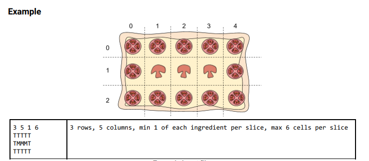
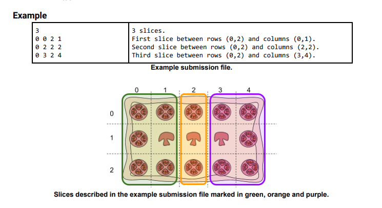

# TeamPizza

### Practice Problem for Google Hash Code 2017

### Introduction

Did you know that at any given time, someone is cutting pizza somewhere around the world? The decision
about how to cut the pizza sometimes is easy, but sometimes it’s really hard: you want just the right amount
of tomatoes and mushrooms on each slice. If only there was a way to solve this problem using technology...

### Problem description

**Pizza**

The pizza is represented as a rectangular, 2-dimensional grid of R rows and C columns. The cells within the
grid are referenced using a pair of 0-based coordinates [r, c] , denoting respectively the row and the
column of the cell.

Each cell of the pizza contains either:
 - mushroom, represented in the input file as M 
 - tomato, represented in the input file as T
 
**Slice**

A slice of pizza is a rectangular section of the pizza delimited by two rows and two columns, without holes.
The slices we want to cut out must contain at least L cells of each ingredient (that is, at least L cells of
mushroom and at least L cells of tomato) and at most H cells of any kind in total - surprising as it is, there is
such a thing as too much pizza in one slice.
The slices being cut out cannot overlap. The slices being cut do not need to cover the entire pizza.

**Goal**

The goal is to cut correct slices out of the pizza maximizing the total number of cells in all slices.
Input data set
The input data is provided as a data set file - a plain text file containing exclusively ASCII characters with
lines terminated with a single ‘\n’ character at the end of each line (UNIX- style line endings).

**File format**

The file consists of:
 - one line containing the following natural numbers separated by single spaces:
	 - R (1 ≤ R ≤ 1000) is the number of rows
	 - C (1 ≤ C ≤ 1000) is the number of columns
	 - L (1 ≤ L ≤ 1000) is the minimum number of each ingredient cells in a slice
	 - H (1 ≤ H ≤ 1000) is the maximum total number of cells of a slice
 
 - R lines describing the rows of the pizza (one after another). Each of these lines contains C
characters describing the ingredients in the cells of the row (one cell after another). Each character
is either ‘M’ (for mushroom) or ‘T’ (for tomato).

**Example**

**Submissions**

**File format**

The file must consist of:
- one line containing a single natural number S (0 ≤ S ≤ R × C) , representing the total number of slices to be cut,
- U lines describing the slices. Each of these lines must contain the following natural numbers separated by single spaces:
-  r 1 , c 1 , r 2 , c 2 describe a slice of pizza delimited by the rows r (0 ≤ r1,r2 < R, 0 ≤ c1, c2 < C) 1 and r 2 and the columns c 1 and c 2 , including the cells of the delimiting rows and columns. The rows ( r 1 and r 2 ) can be given in any order. The columns ( c 1 and c 2 ) can be given in any order too.

### Validation

For the solution to be accepted:
- the format of the file must match the description above,
- each cell of the pizza must be included in at most one slice,
- each slice must contain at least L cells of mushroom,
- each slice must contain at least L cells of tomato,
- total area of each slice must be at most H

### Scoring

The submission gets a score equal to the total number of cells in all slices.
Note that there are multiple data sets representing separate instances of the problem. The final
score for your team is the sum of your best scores on the individual data sets.

### Scoring example

The example submission file given above cuts the slices of 6, 3 and 6 cells, earning 6 + 3 + 6 = 15 points.
